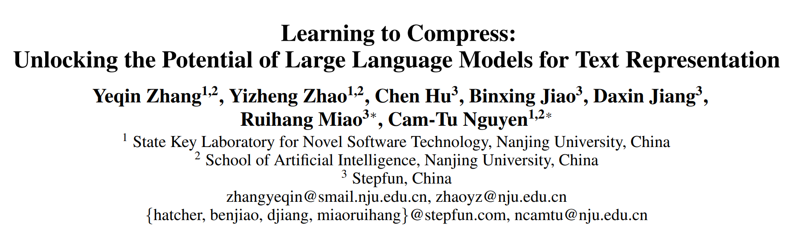
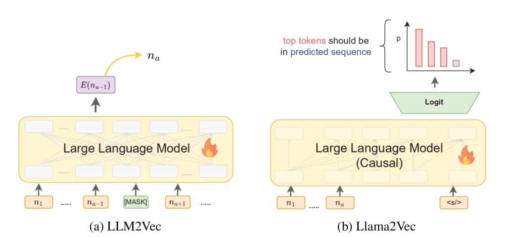
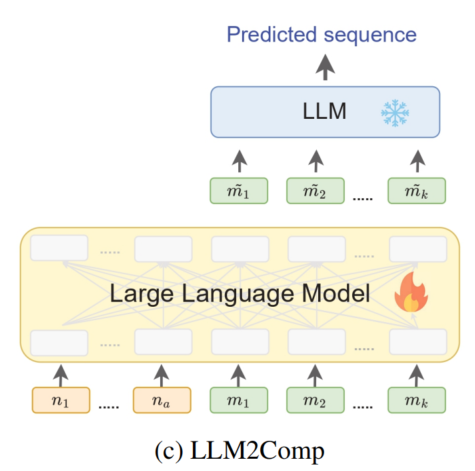
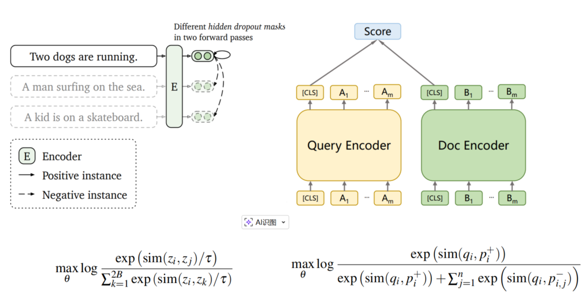
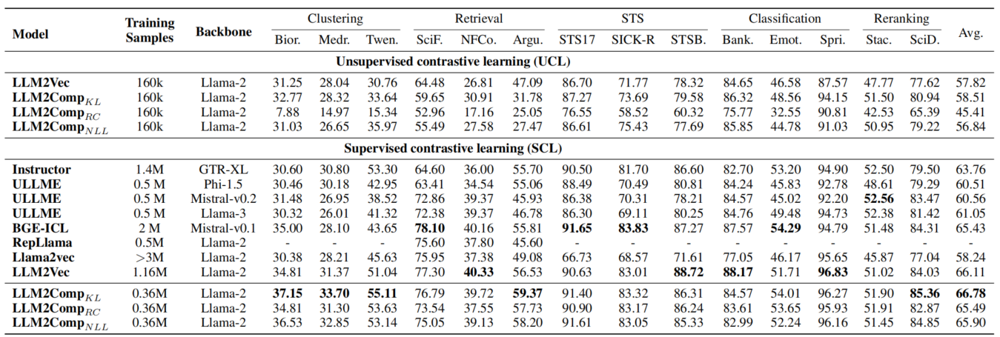
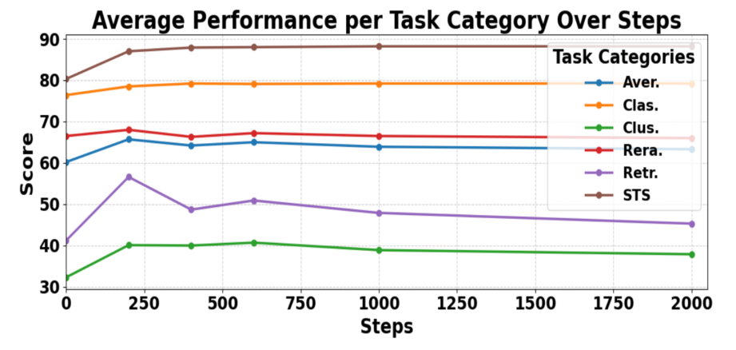
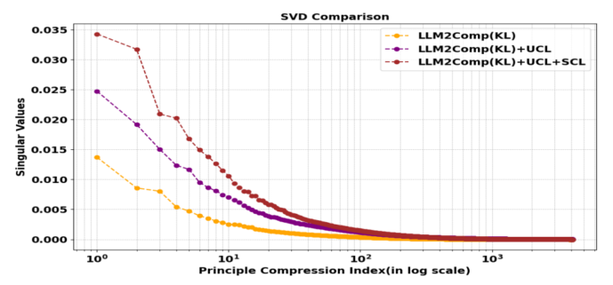

# AAAI 2026 | LLM2Comp：利用上下文压缩解锁大语言模型的文本表征潜力，打破维度崩溃困境

## 引言

文本表征是聚类、检索和众多下游应用的核心基础。随着大语言模型(LLMs)的崛起，研究者们越来越关注如何利用LLMs强大的能力进行高质量文本表示。然而，「大多数LLMs本质上是因果模型，针对下一个词元预测进行优化，这使得它们在生成整体、连贯的文本表征方面存在天然局限」。

传统方法如LLM2Vec采用掩码下一词元预测(MNTP)等token-level预训练任务，但这些方法往往无法捕捉整个序列的语义完整性。为此，本文作者提出了**LLM2Comp**，一种创新的文本表征框架，成功「通过上下文压缩这一预训练任务，解锁了LLMs在文本表征方面的巨大潜力」。

**论文**：https://arxiv.org/pdf/2511.17129

**代码**：https://github.com/longtaizi13579/LLM2Comp

## 研究背景

文本嵌入模型将语义内容转化为向量表征，在检索和推荐等任务中发挥着基础性作用。现有LLM适应文本表征的方法主要分为两类：

- **无需训练的方法**：如最后词元池化(LT)、加权平均池化(WMP)、重复嵌入(EE)和PromptEOL等，这些方法简单但表征质量有限
- **需要训练的方法**：如LLM2Vec采用掩码下一词元预测(MNTP)，Llama2Vec采用基于嵌入的自动编码(EBAE)和自动回归(EBAR)等任务

然而，「这些任务本质上仍然是词元级别（token-level）的，而非序列级别（sequence-level）的预测」，无法真正捕捉整个序列的连贯语义。因此，研究团队提出：**上下文压缩可能是连接因果LLMs与高质量文本表征的关键桥梁**。

## LLM2Comp：压缩赋能的文本表征框架

LLM2Comp框架巧妙地将上下文压缩作为预训练任务，让模型学会生成紧凑的"记忆词元"(memory tokens)，这些词元可以替代整个上下文用于下游序列预测任务。整个框架包含三个核心阶段：

### 1. 压缩预训练：发现最优训练目标

研究团队探索了三种压缩目标：
- **重构任务(Reconstruction Task)**：让模型从压缩词元中重建原始句子
- **续写任务(Continuation Task with NLL)**：让模型预测后续词元
- **知识蒸馏续写任务(CTKD)**：让模型预测后续词元的概率分布，与原始扩展序列对齐

实验表明，**CTKD显著优于其他压缩目标**，因为它：
- 训练更稳定(标准差1.37 vs 2.65和5.32)
- 更不易受维度崩溃问题的影响
- 生成的词元多样性更高，信息保留更完整

> **关键洞察**：维度崩溃是指嵌入向量仅占用原始嵌入空间的一个低维子空间。CTKD通过知识蒸馏损失作为正则化器，更好地保留了低频词元的信息，从而缓解了维度崩溃问题。

### 2. 消除维度崩溃：对比学习的魔力

尽管CTKD预训练显著改善了文本表征，但嵌入空间仍然存在维度崩溃问题。研究团队设计了一个两阶段对比学习策略：

- **无监督对比学习(UCL)**：利用dropout构造正样本，批次内其他句子作为负样本
- **有监督对比学习(SCL)**：利用标注数据进一步优化表征空间

这种设计成功将LLM2Comp的有效维度从10提升到100+，显著增强了模型的表征能力。

### 3. 任务导向的优化：记忆词元数量的权衡

实验发现记忆词元数量对不同任务的影响各异：
- 对于大多数任务，1-8个记忆词元足以保持稳定性能
- 检索任务对记忆词元数量更敏感，8个是最佳选择
- 超过16个记忆词元反而会导致性能下降

> **反直觉发现**：与上下文压缩文献相比(通常使用100+个词元)，LLM2Comp只需8个记忆词元就能达到最佳性能，这揭示了文本表征与序列生成对压缩的不同需求。

## 实验结果

LLM2Comp在14个多样化任务上进行了全面评估，涵盖聚类、检索、语义文本相似度(STS)、分类和重排序等六大类别：

### 1. 与现有方法的对比

在MTEB基准测试中，LLM2Comp显著超越了现有LLM基础的文本编码器：
- 以**仅0.36M训练样本**超过了需要1.16M样本的LLM2Vec
- 平均得分达到**66.78%**，拿到了最高分

### 2. 样本效率优势

LLM2Comp最引人注目的优势是其样本效率：
- 在SCL阶段，LLM2Comp仅需200步训练即达到最佳性能
- 相比LLM2Vec减少了 **69%** 的训练样本需求
- 这种效率不仅降低了训练成本，也减少了对大规模标注数据的依赖

### 3. 维度崩溃分析

通过奇异值分解(SVD)分析，研究团队证实：
- LLM2CompKL(预训练)+UCL+SCL的有效维度显著高于仅使用预训练的模型
- 有效维度的增加与模型性能提升呈正相关
- 这为理解对比学习如何改善文本表征提供了新的理论视角

## 技术启示

LLM2Comp的成功验证了几个关键假设：
1. **上下文压缩是LLM无监督适应文本表征的有效预训练任务**
2. **CTKD目标通过分布对齐，比单纯预测下一词元更有利于学习高质量表征**
3. **记忆词元需要在信息保留和冗余消除之间取得平衡**

> **核心洞见**：LLM2Comp的预训练为对比学习提供了更高质量的初始化，使模型能更快地平衡"对齐"(alignment)和"有效维度"(effective dimensionality)这两个关键属性，从而实现更高效的训练。

## 总结与展望

LLM2Comp成功解锁了大语言模型在文本表征方面的潜力，通过巧妙的上下文压缩预训练任务和对比学习后训练，显著提升了表征质量和训练效率。这一工作不仅提出了一个新的SOTA模型，更「揭示了预训练目标与表征质量之间的深层次联系」。

研究团队认为，LLM2Comp的核心思想可以扩展到更多场景：
- 多模态表征学习
- 低资源语言适应
- 领域自适应表征

这项工作为未来研究提供了新的思路：如何设计更适合序列级语义建模的预训练任务，以及如何更有效地将LLM的知识转化为高质量的表征能力。